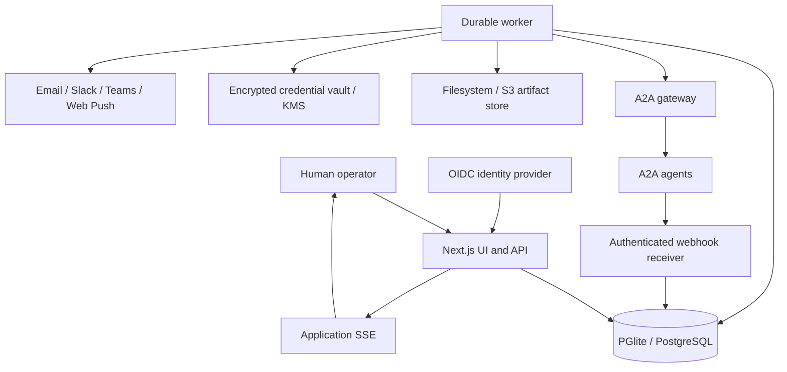

# Target architecture

## Purpose

This document defines the intended production architecture of **A2A Ops**
(formally, **A2A Operations Console**). It is the architectural contract for
implementation; the current code is allowed to be behind this design but must
converge on it phase by phase.

The system is an A2A client and human operations console. It does not own the
remote agents' internal execution. It durably records the A2A work it starts or
observes, presents the current state as an inbox, and routes authorized human
actions back to the appropriate agent.

## Architectural style

Start as a **modular monolith with separate web and worker entry points**:

- one repository and one domain model;
- a stateless Next.js web tier for UI, authenticated APIs, and application SSE;
- one or more background workers for outbound commands, long-lived A2A
  subscriptions, reconciliation, projections, and notifications;
- PostgreSQL-compatible persistence accessed behind application ports;
- no network microservice split until scale or ownership requires it.

This gives local simplicity without coupling long-running work to HTTP request
lifetimes. Module boundaries must be strong enough to extract a worker or
notification service later without rewriting domain logic.

## System context



## Runtime components

### Web tier

- Renders the catalog, inbox, task detail, chat, flow, approval, and settings
  experiences.
- Terminates Plane A user sessions through OIDC.
- Authorizes every read and command through an application policy service.
- Accepts commands and commits intent; it does not hold a remote task stream
  open for the lifetime of the task.
- Exposes application SSE based on committed local state, not a direct pipe of
  one browser's connection to one remote agent.

### Application services

- `AgentCatalogService`: registration, discovery snapshots, health, skills,
  interfaces, trust, and administrative policy.
- `TaskCommandService`: start, reply, cancel, refresh, assign, and link work.
- `InboxQueryService`: tenant-scoped task and notification projections.
- `DecisionService`: typed approve/reject/edit/request-changes decisions.
- `AuditService`: append-only user and system action records.
- `AuthorizationService`: org, team, agent, skill, and task policy checks.

Application services depend on ports, not MikroORM, HTTP, the A2A SDK, S3, or a
specific notification provider.

### Worker runtime

- Claims transactional-outbox work using a lease.
- Dispatches A2A commands with persisted message and idempotency IDs.
- Maintains or renews remote subscriptions outside a Next.js request.
- Registers and maintains push-notification configurations.
- Reconciles uncertain state with `GetTask` and `ListTasks`.
- Sends every stream, webhook, and reconciliation event through one ingestion
  pipeline.
- Builds current-state projections and emits notification/live-update intents.

### A2A gateway

- Owns Agent Card discovery and normalization.
- Selects a declared interface and transport.
- Resolves Plane B credentials server-side.
- Applies outbound network policy, timeouts, redirect policy, response limits,
  protocol versioning, and extension negotiation.
- Reuses the official `@a2a-js/sdk`; it does not fork protocol types.

### Event ingestion

All event sources use this path:

```text
stream | webhook | GetTask/ListTasks reconciliation
  -> authenticate and validate source
  -> normalize envelope
  -> resolve local agent/tenant/task identity
  -> deduplicate
  -> append raw protocol event
  -> update normalized messages/artifacts
  -> update task projection
  -> append audit/outbox records where applicable
  -> commit atomically
```

Push delivery is at-least-once, and streams can reconnect or replay. Therefore
idempotency is a correctness property, not an optimization.

## Durable command flow

1. Authenticate the user.
2. Authorize the action.
3. Validate input and assign a command ID and stable A2A `messageId`.
4. In one database transaction, persist the command/audit intent and an outbox
   row.
5. Return an accepted local operation to the browser.
6. A worker claims the outbox row and calls the remote agent.
7. Responses enter the common event-ingestion path.
8. Projection changes create live-update and notification outbox rows.
9. The UI refreshes from server state; the browser may disconnect at any time.

Retries must reuse the stable message ID. A retry must not silently create a
second remote task when the previous result is uncertain.

## Persistence

### ORM and databases

- **MikroORM** supplies the Data Mapper, Entity Repository, Unit of Work,
  Identity Map, migrations, and transaction boundary.
- **PGlite** is the default local development database because it is embedded
  while preserving PostgreSQL semantics.
- **PostgreSQL** is the canonical production database and migration target.
- **SQLite/libSQL** may be added as an optional adapter. It must pass the same
  repository contract tests and may require its own migrations; the domain
  must not be weakened to accommodate SQLite behavior.

Use request-scoped/forked entity managers. Never share a MikroORM identity map
between requests or worker jobs.

### Stores outside the relational database

- `ArtifactStore`: local filesystem in development; S3-compatible storage in
  production. Relational rows contain metadata, digest, media type, size, and
  object key.
- `CredentialVault`: locally encrypted values for development; envelope
  encryption backed by KMS or an external secret manager in enterprise.
- Wire payloads and raw protocol events have explicit retention controls
  because they can contain sensitive content.

## Ports and adapters

Required application ports:

```text
OrganizationRepository       AgentRepository
TaskRepository               TaskEventRepository
ConversationRepository       DecisionRepository
AuditRepository              NotificationRepository
OutboxRepository             IdempotencyRepository
CredentialVault              ArtifactStore
RealtimePublisher            NotificationChannel
A2AGateway                   Clock
```

Do not create one unbounded generic CRUD repository. Each repository exposes
domain operations and query shapes that preserve tenancy and invariants.

## Identity and tenancy

- Every persistent row that belongs to a customer carries `organizationId` or
  is reachable only through an organization-scoped parent.
- Application primary keys are UUIDs generated locally.
- A remote A2A task is identified by `(agentId, tenant, remoteTaskId)`, not by
  `remoteTaskId` alone.
- A remote context and message are also scoped to their agent/tenant boundary.
- Local workflows link tasks from different agents using local IDs and typed
  relations. Cross-agent `referenceTaskIds` are never assumed to be portable.

## Authentication and authorization

- Plane A authenticates people using an optional local-development identity
  adapter and production OIDC sessions in httpOnly cookies.
- Plane B authenticates the console to each agent using static API keys,
  bearer tokens, OAuth client credentials, mTLS, or user-delegated OAuth.
- In-task `AUTH_REQUIRED` is a protocol state and is not equivalent to either
  Plane A login or generic business approval.
- Authorization is enforced server-side for organization, team, agent, skill,
  task visibility, task action, credential administration, and agent
  registration.

## Security boundaries

- Agent registration and credential changes are administrative operations.
- Outbound targets use explicit policy/allowlists. DNS resolution and the
  actual connection target must not diverge.
- Redirects never forward credentials across origins.
- Agent Card signatures and provider trust are recorded and surfaced.
- Remote artifact URLs are not loaded blindly in the browser. The artifact
  gateway validates policy, media type, size, and download disposition.
- Webhooks authenticate the sender, validate the expected task, apply rate
  limits, and process duplicate deliveries idempotently.
- Logs, errors, telemetry, wire data, and audits use explicit redaction rules.

## Real-time delivery

Application SSE is the initial browser transport. The durable state remains in
the database; SSE is only a freshness signal.

- Local/single-process: in-process publisher backed by persisted outbox rows.
- Multi-process: PostgreSQL notification/polling adapter initially.
- Larger installations: Redis Streams, NATS, or an equivalent adapter may be
  introduced without changing application services.

Missing a live signal is harmless because clients re-query durable state.

## Deployment profiles

### Local

- Next.js web process
- embedded command, subscription, push and reconciliation workers sharing the PGlite owner (ADRs 0007/0008)
- file-backed PGlite
- local artifact directory
- development identity and locally encrypted secrets

Slices 2.1/2.2 run embedded command dispatch and a subscription pool in the
long-running Next.js Node server for the local PGlite profile. PostgreSQL
supports a separate task worker with `A2A_COMMAND_WORKER_MODE=external` and
`npm run worker:tasks` (`worker:commands` remains a compatibility alias). Both
profiles share application services and lease protocols. Subscription intent
commits with task ingestion, survives process restart, and reconnects without
a browser. The existing browser stream reads committed events; application SSE
freshness signals remain a subsequent slice (ADR 0008).

Slice 2.3 adds opt-in push registration and cleanup in the same worker profiles.
Intent commits with ingestion, while leased workers perform remote config
operations. Callback credentials derive from server-only configuration and a
registration identity; rows store no secret values. Callbacks authenticate,
validate the expected scoped task, and commit through the shared ingestion
transaction. Terminal and disabled registrations reject further state changes.
See ADR 0009 and the README for operator configuration and replay limitations.

Slice 2.4 adds scoped GetTask polling and ListTasks sweeps with durable pagination
and read leases. Intent commits with ingestion; full list sweeps request artifacts
and update known scoped tasks only. Input/auth-required work remains polled.
Reconciliation validates remote identity and checks the task version captured
before the read, so concurrent updates win. It never resends uncertain commands.
Both worker profiles share the same ports and lease protocol (ADR 0010).

Slice 2.5 adds projector version 2 with task headers, message rows and artifact
rows. Ingestion and explicit rebuild share a deterministic ledger reducer.
Rebuild validates original archives outside the task lock and activates only if
the captured task version still matches. Content reads join the active pointer
and normalized rows in one database snapshot; inbox reads retain typed indexes.
The operator CLI is online for PostgreSQL and offline for the PGlite profile;
the running PGlite owner can call the runtime rebuild service. See ADR 0011.

### Docker/demo

- web container
- worker container
- PostgreSQL container
- optional MinIO container
- fixture A2A agents

### Enterprise

- multiple stateless web replicas
- horizontally scaled workers with leases
- managed PostgreSQL with backups and point-in-time recovery
- S3-compatible object storage
- OIDC identity provider
- KMS/external secret manager
- optional shared real-time/message-bus adapter

## Intended code boundaries

The exact directories may evolve, but dependencies must point inward:

```text
src/server/domain/          entities, value objects, domain rules
src/server/application/     commands, queries, use cases, ports
src/server/adapters/db/     MikroORM entities, repositories, migrations
src/server/adapters/a2a/    official SDK gateway implementation
src/server/adapters/auth/   sessions, policy, credential adapters
src/server/adapters/blob/   filesystem and S3 artifact stores
src/server/adapters/live/   SSE and shared-bus adapters
src/server/workers/         dispatch, subscription, reconciliation, notification
src/app/api/                thin HTTP adapters only
src/components/             presentation
```

Domain and application modules must not import React, Next.js, MikroORM, or a
specific database driver.

## Evolution rules

- Prefer a new adapter over a conditional spread throughout application code.
- Prefer additive schema changes and explicit backfills.
- Preserve raw protocol events before changing projections so projections can
  be rebuilt.
- Do not split services across the network merely to mirror module names.
- Record changes to these decisions in an ADR before implementation.
