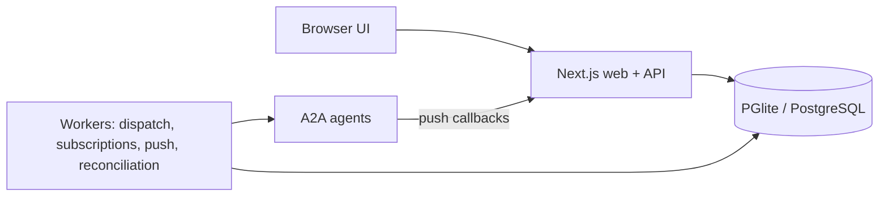

# Agent Taskbay

[](https://github.com/allsrc/agent-taskbay/actions/workflows/ci.yml)
[](./LICENSE)

**The human operations console for A2A agent workflows.** Start work with an [A2A](https://a2a-protocol.org) agent, keep tracking it after
your browser closes, and step in when the agent needs input or an approval, with a record of who decided what.

Created and maintained by [Shashi Kanth G S](https://shashikanth.me), part of [Allsrc](https://allsrc.dev).

> **Status: pre-1.0 (`0.1.0`), published to npm.** Interfaces may change between minor versions. See [Status and roadmap](docs/project/status-and-roadmap.md) for what works, what is partial and what is planned.

## What problem it solves

A2A covers agent-to-agent delegation. It does not give a *person* a place to start a long-running task, be pulled back in when an agent
asks for input or approval, and later show who approved what. Agent Taskbay is that place. It is an A2A **client** with a server-side
runtime: it does not run agents and does not replace the orchestrator in your agent mesh.

## Try it

Needs Node.js 22.19 or newer. No database server and no `.env` file.

```bash
npx agent-taskbay
```

This starts the console at <http://127.0.0.1:3002> with an embedded database in `~/.agent-taskbay`, signed in as a local administrator. It binds
to loopback only. In a second terminal, serve a sample agent (a test fixture, not a real agent):

```bash
npx agent-taskbay demo-agent
```

To run from a git checkout instead, see the [quickstart](docs/quickstart.md#1-run-the-console-from-source).

Then in the console:

1. **Agents → Add agent**, paste `http://127.0.0.1:4010/showcase/card.json`, then **Fetch Agent Card → Continue → Connect**.
2. Open the agent, **Start chat**, and send `please approve the deploy`.
3. Open **Inbox**. The task is waiting on you with a pending approval ("Delete the staging cluster", risk High). **Approve** it.

**What you should see:** the approval becomes `approved`, the exact reviewed content is sent to the agent once, and the task moves to
completed. The decision and its delivery are in the audit trail. Close the browser mid-way and reopen it: state is in the database, not the tab.
The [quickstart](docs/quickstart.md) shows each step in detail, including what to check when one fails.

## What you get

| Capability | In short |
| --- | --- |
| Agent catalog | Connect agents by Agent Card URL; discovery of skills, interfaces and security schemes. |
| Durable tasks | Commands are saved before they are sent. Workers follow tasks by stream, push callback and polling, so work continues with no browser open. |
| Human decisions | Approvals execute against the exact reviewed revision, once. Input requests, task ownership, due times and escalation. |
| Audit trail | Append-only record of workflow and security-relevant actions. |
| Notifications | In-app inbox and one optional signed webhook per organization. |
| Rich content | Text, Markdown, JSON, CSV, images, audio, video, PDF and files are rendered by fixed code; agent-supplied code is never run. Optional structured forms, approval requests and a subset of A2UI. |
| Access control | OIDC sign-in, organization roles, encrypted agent credentials, team/agent/skill grants, an outbound origin allowlist. |

Each row is explained, with its limits, in [Concepts](docs/concepts/overview.md).

## Why you might not want this

- **Pre-1.0.** `0.1.0` is the first release; interfaces may change between minor versions.
- **No stable API or SDK.** The HTTP API needs a browser session cookie and a matching `Origin`; there are no service tokens and no `/api/v1`
  ([#31](https://github.com/allsrc/agent-taskbay/issues/31)). Use it as a console, not as a backend for scripts.
- **Local mode is not a security boundary.** It signs everyone in as an administrator and binds to loopback only. Anything shared needs OIDC.
- **No hosting artifacts.** There are no container images, Compose file, Helm chart, health endpoint or backup tooling. A single organization
  per deployment; the artifact store is the local filesystem. See [Production deployment](docs/guides/production-deployment.md).
- **Service credentials only.** Agents are reached with credentials the administrator stores; per-user delegated OAuth is not built
  ([#1](https://github.com/allsrc/agent-taskbay/issues/1)).
- **No gRPC.** Agents that only offer gRPC are rejected.
- **Plain replies can bypass an open approval** ([#16](https://github.com/allsrc/agent-taskbay/issues/16)).
- **Not a protocol testbench, an agent framework or a workflow designer.** Saved views, search and bulk triage are not built
  ([#5](https://github.com/allsrc/agent-taskbay/issues/5)).
- **Tested versions are narrow:** Node.js 22.19 and PostgreSQL 18 are what CI runs. Browser support is not verified.

The full table of supported and unsupported behavior is in [Compatibility and limitations](docs/reference/compatibility.md).

## What your agents must provide

Taskbay works with any A2A agent that publishes an Agent Card over HTTP(S). Richer behavior is opt-in, per agent, by advertising an
extension in the card; otherwise content is shown as ordinary data.

| You want | The agent must |
| --- | --- |
| Typed input instead of free text | Advertise the [structured form extension](docs/reference/extensions/structured-form.md) |
| The agent to ask for approval | Advertise the [approval request extension](docs/reference/extensions/approval-request.md) |
| Access limited to one skill | Advertise and enforce [skill routing](docs/reference/extensions/skill-routing.md); otherwise a whole-agent grant is needed |
| Agent-driven UI | Send a [supported A2UI subset](docs/reference/a2ui.md) |

How to build that side is in [Build an agent for Taskbay](docs/guides/build-an-agent-for-taskbay.md).

## How it fits together



The browser never talks to agents and never sees their credentials. In local mode the workers run inside the web process; with PostgreSQL
they can run separately. Details: [Overview](docs/concepts/overview.md) and [Durable tasks](docs/concepts/durable-tasks.md).

## Documentation

Start at the [documentation index](docs/README.md). Short version:

| Your question | Page |
| --- | --- |
| Can I make it work? | [Quickstart](docs/quickstart.md) |
| How does it work, and why? | [Concepts](docs/concepts/overview.md) |
| How do I do a task? | [Guides](docs/README.md#guides) |
| What exactly is supported? | [Reference](docs/README.md#reference) |
| What happens when it fails? | [Troubleshooting](docs/operations/troubleshooting.md) |
| Is it secure? | [Threat model](docs/security/threat-model.md), [SECURITY.md](SECURITY.md) |
| What will upgrading cost? | [Upgrading](docs/guides/upgrading-and-backups.md), [CHANGELOG](CHANGELOG.md) |
| How do I contribute? | [CONTRIBUTING.md](CONTRIBUTING.md) |

The earlier planning documents (decision records, phase specs, evidence log) are kept in [`docs/archive/`](docs/archive/README.md).

## Acknowledgements and license

Built on the official [`@a2a-js/sdk`](https://www.npmjs.com/package/@a2a-js/sdk). The gateway, content model and rendering stack are adapted
from [SpanPlane](https://github.com/shashikanth-gs/spanplane) (Apache-2.0; see [`NOTICE`](NOTICE)). MIT licensed ([`LICENSE`](LICENSE)).

Agent Taskbay is an independent open-source project. It is not affiliated with, endorsed by, or sponsored by the A2A project or the Linux
Foundation. "A2A" and "Agent2Agent" refer to the open protocol and are used only to describe compatibility.
