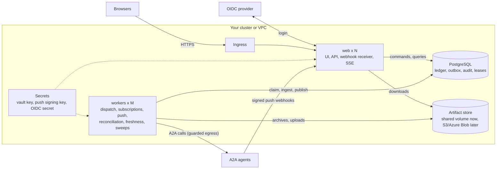
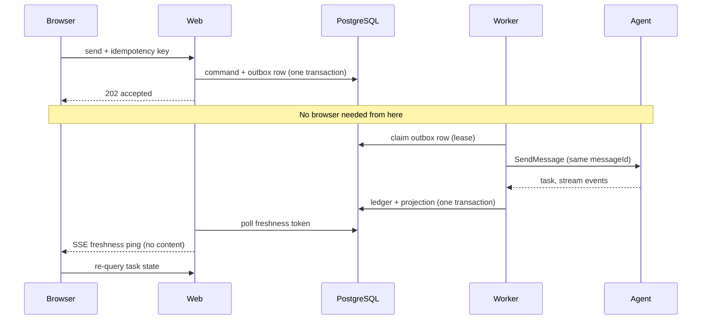

# Production topology (design)

> **Status: design, not a shipped deployment.** The repository has no Dockerfile, compose file or Helm chart yet, and the S3/Azure
> artifact adapter and the KMS adapter are Phase 7 work (see `docs/spec/PHASES.md`). This page records the intended topology and what
> exists today so hosting can be planned later. The authoritative architecture is [`ARCHITECTURE.md`](../../ARCHITECTURE.md).

## Shape

Two kinds of process share one database. **Web** replicas are stateless: they serve the UI and API, receive agent push webhooks and
publish the live-update stream. **Workers** own everything that talks to agents: command dispatch, long-lived subscriptions, push
registration, reconciliation, freshness publishing, the approval sweep and notification delivery. Workers coordinate through database
leases, so any number can run.



## Containers

| Container | Count | Notes |
|---|---|---|
| `web` | N, stateless | `A2A_COMMAND_WORKER_MODE=external` so it does not run workers itself. |
| `worker` | M | `npm run worker:tasks`. Requires PostgreSQL and the same artifact storage and server configuration as web. |
| PostgreSQL | 1, or a managed service | Canonical production database. Backups and point-in-time recovery are the operator's. |
| MinIO | optional | Only if S3-compatible storage is not provided elsewhere, and only once the S3 adapter exists. |
| Fixture agents | demo only | The reference agents; never part of production. |

Minimum: web, worker and PostgreSQL. With managed PostgreSQL that is two containers. No message bus is needed at first; the
PostgreSQL polling adapter carries the live-update signal between workers and web replicas (ADR 0012).

## One send, end to end



The command and its outbox row commit together, so a retry reuses the same message ID and a crash after the 202 loses nothing.
The live signal carries no content; the browser always re-reads durable state.

## Artifact storage

Binary artifact parts, user uploads and original protocol-event archives live behind the `ArtifactStore` port
(`src/server/application/ports/artifact-store.ts`):

```ts
put(organizationId, bytes) -> { objectKey, digest, sizeBytes }
get(organizationId, digest) -> bytes | undefined
```

Objects are content-addressed, organization-scoped and immutable. The relational rows keep only metadata. Projection rebuild reads the
archived events, so losing them makes a task with binary content unrecoverable.

The code is **not coupled to S3**. Only the filesystem adapter exists today, and the runtime constructs it directly in
`src/server/runtime/task-persistence.ts`; there is no configuration switch yet.

| Environment | Backend |
|---|---|
| Local / development | `FilesystemArtifactStore` in the data directory (`A2A_ARTIFACT_DATA_DIR`). |
| Docker / demo | Filesystem on a shared volume, or MinIO once an S3 adapter exists. |
| Kubernetes | Today a `ReadWriteMany` volume mounted by web and worker pods. Later an S3-compatible bucket. |
| Azure | Today Azure Files as a shared volume. Later an Azure Blob adapter, which needs its own small adapter and an ADR amendment because the accepted decision names S3-compatible storage. |

Gaps for any new backend: the port has no delete, list or retention methods; a store writes bytes before the database transaction
commits, so adapters must tolerate orphans; backups must cover the store as well as the database.

## Built and not built

Built: web and worker entry points, lease-based workers, the PostgreSQL profile, OIDC sessions, the encrypted credential vault, the signed
push receiver, the audit log, shared-volume artifact storage.

Not built: Dockerfile, compose file or Helm chart; S3 or Azure Blob adapter and adapter selection by configuration; KMS adapter; backup and
restore runbooks; tested replica-loss recovery. These are the Phase 7 deliverables.
