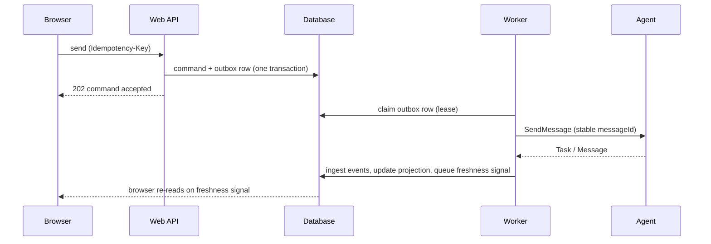

# Durable tasks

> For readers who want to know why a task survives a closed browser, what the console does when something goes wrong, and what "uncertain" means.

A task in Taskbay is a database record that the console keeps current. Browser tabs, SSE connections and agent streams are only ways of finding out that the record changed.

## The path of a command

When you send a message, reply, or cancel a task, the console does this:

1. Checks your session and your permission for that agent (and skill).
2. Validates the input and assigns a command ID and a fixed A2A `messageId`.
3. In one database transaction, saves the command and a row in a transactional outbox. The request body is archived in the artifact store. The database row holds its digest.
4. Returns `202 Accepted`. Nothing has been sent to the agent yet.
5. A worker claims the outbox row under a lease and calls the agent.
6. The agent's response goes through the same ingestion path as every other source (below).

You can close the browser at step 4. The worker carries on.

### Idempotency

Commands carry an `Idempotency-Key` header (1 to 255 characters), scoped to the organization. Repeating a key with the same content returns the same command. Reusing a key for different content returns `409`. The A2A `messageId` is fixed once and reused on every attempt.

A stable `messageId` is a hint to the agent, not a guarantee. Taskbay cannot know whether a particular agent de-duplicates on it.

## Uncertain outcomes

The one dangerous moment is a failure after the request has left the console. The agent may have received it and started work, or not.

| Failure | What the worker does |
| --- | --- |
| Agent discovery fails before anything is sent | Retries with backoff, up to three attempts, then marks the command `failed`. Safe, because nothing was sent. |
| Agent disabled, or the input archive is missing | Marks the command `failed`. |
| Anything after the request was dispatched (timeout, connection drop, error response) | Marks the command `uncertain`. Does not resend. |
| The worker dies mid-dispatch and its lease expires | Marks the command `uncertain`. |

The console never resends an uncertain command and never declares one successful by guessing. The command status says "Remote outcome is uncertain. Automatic resend is disabled; check the task before submitting new work." A person decides whether to send again. For an initial send, reconciliation cannot tie an arbitrary remote task to a lost send, so it will not adopt one.

## One ingestion path

Task state can arrive by four routes:

- the response to a command,
- a stream (`SendStreamingMessage` or `SubscribeToTask`),
- a push webhook from the agent,
- polling with `GetTask` and `ListTasks`.

All four are validated, normalized and written by the same service. It locks the task row, de-duplicates the event, appends the raw protocol event to a ledger, rebuilds the task's projection, and queues any freshness or notification intents, in one transaction. Stream reconnects and at-least-once webhooks replay events, so duplicates are normal. De-duplication uses source identity when the source supplies one and a payload fingerprint otherwise.

Known gap: if an agent sends identical append chunks of an artifact with no delivery ID and no ordering, the console cannot always tell a repeat from a replay, and errs toward collapsing them. Agents should send complete artifact snapshots, or a stable `X-A2A-Delivery-ID` on pushes.

## Keeping a task current without a browser

| Mechanism | Behavior |
| --- | --- |
| Subscription (stream) | One per active task. Workers hold up to 8 concurrent streams each. Reconnect uses `SubscribeToTask`, so it observes and never resends. Backoff is exponential, capped at 30 s. Stops at a terminal, input-required or auth-required state, and is re-armed when a new command makes the task active again. Needs the agent to advertise streaming. |
| Push webhook | Opt-in. Needs `A2A_PUSH_CALLBACK_ORIGIN` and `A2A_PUSH_SIGNING_KEY`. Each task gets a registration ID and a derived bearer credential. Callbacks are authenticated, rate-limited per registration, and checked against the expected task. Without these settings, push is simply not used. |
| Reconciliation | `GetTask` for each open known task every 15 s, including tasks waiting for input. `ListTasks` sweeps per agent and tenant, repeating 60 s after a sweep finishes. It only updates tasks the console already knows. Agents without `ListTasks` fall back to `GetTask`. |

If every stream and webhook fails, reconciliation still converges the state. A reconciliation read that arrives after a concurrent update loses to it, and a terminal task is never reopened by a late response.

## Projections and freshness

Raw events live in an append-only ledger. What the screens read is a projection: a task header with typed, indexed columns (state, owner, due time, timestamps), ordered message rows and assembled artifact rows. Inbox queries use the indexed columns and do not scan event payloads.

The projection is derived by a deterministic reducer, so it can be rebuilt from retained events. Rebuild prepares the new generation outside the task lock, verifies archived binary digests, then swaps it in only if the task has not changed in the meantime. A failed rebuild keeps the old generation readable. Rebuild never sends anything to an agent. It cannot restore history that retention has deleted. See [Upgrading and backups](../guides/upgrading-and-backups.md) for the command.

To tell browsers something changed, every accepted projection write queues a `task.freshness` outbox row. A worker publishes it. `GET /api/tasks/events` streams three content-free events: `ready` (sent on every connection), `freshness` and `resync` (after about 15 s of quiet). Connections last about 55 s and then the browser reconnects. Signals carry no task data. On any signal, on reconnect, on focus and on a 5-second fallback poll, the browser re-queries. A lost signal costs at most a few seconds of staleness.

## Identity of remote IDs

Agents issue task, context and message IDs, and two agents can issue the same string. The console therefore keys remote tasks by `(agentId, tenant, remoteTaskId)` and uses its own UUIDs for every URL and permission check. Remote IDs are shown for diagnosis only. A direct `Message` reply (no task) is kept as a message and is never turned into a fake task.

The design intends a way to link tasks across agents with local relations, and never to pass one agent's task ID to another. No link table exists in the code yet.

## When it fails

| Symptom | Likely cause | What to do |
| --- | --- | --- |
| Command stuck `pending` | No worker running, or the agent is disabled | Check the worker is running. See [Running and workers](../operations/running-and-workers.md) |
| Command `uncertain` | Failure after dispatch, or lease expiry | Open the task, check its state, and send again only if the agent did nothing |
| Task never leaves `working` with no browser open | Agent lacks streaming and push is off | Reconciliation will catch up within about 15 s. Check agent health |
| UI is a few seconds stale | Freshness signal lost | The 5 s fallback poll covers it |
| Rebuild refuses | Ledger empty or an archive is missing or corrupt | Restore from backup. It fails closed on purpose |

More in [Troubleshooting](../operations/troubleshooting.md).

## Limits

- The ledger can hold sensitive content. Retention controls are not yet implemented, so ledger and archives grow without bound.
- The audit and inbox queries are computed on request and are bounded by page size. Very large organizations may need further indexing.
- The local profile runs the workers in the web process. Stopping the process stops all background work.

## Further reading

- [Decision records: durable commands, ledger and outbox](../archive/adr/0007-command-dispatch-and-local-worker.md)

## Related

- [Overview](overview.md)
- [Human in the loop](human-in-the-loop.md)
- [Running and workers](../operations/running-and-workers.md)
- [Data model](../reference/data-model.md)
