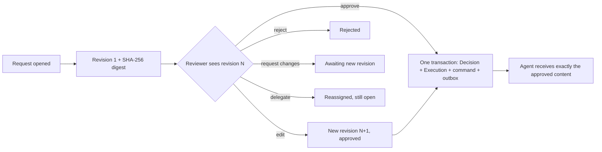

# Human in the loop

> For readers who want to understand how work reaches a person, how an approval is made safe, and how ownership, escalation, audit and notifications fit together.

Agents stop and ask. Some questions are routine ("which region?"). Some are risky ("send this email to 4,000 customers"). Taskbay treats these differently and records both.

## Three kinds of "an agent needs a person"

| Situation | What it is | How a person resolves it |
| --- | --- | --- |
| Input required | The agent's task is in `INPUT_REQUIRED` and asks a question. | Reply in the task chat, or fill in a structured form if the agent offers one. Anyone with `operate` access can answer. |
| Auth required | The task is in `AUTH_REQUIRED`. | Resolve the authorization out of band. The console does not carry credentials in messages. |
| Approval | A reviewer must authorize a specific proposed action. | A decision on an exact revision of that action, with a recorded rationale. |

Input and auth requests land in the inbox. An approval is a separate object with a stricter lifecycle. `AUTH_REQUIRED` is never treated as an approval.

## The inbox

The inbox is one authorized list across agents, combining tasks and approval requests, newest first, paged by cursor. It is a read-only query over indexed columns, with no separate table to keep in sync. Grants, views and filters are applied in SQL before paging, so a user sees only agents and skills they can read. An administrator sees the whole organization, and a member with no grants sees nothing.

Views: all, active, needs input, assigned, overdue, done. Filters: kind, agent, skill, risk, status, updated after. Pages are at most 100 rows. Saved views, free-text search, arbitrary-assignee filters and bulk actions do not exist yet ([#5](https://github.com/allsrc/agent-taskbay/issues/5)).

## Approvals

An approval is a `DecisionRequest` scoped to one A2A task. The agent, tenant and skill come from the task's own row, never from the proposed content. The design goal: the record alone can show who approved exactly what, and what happened next.

Rules that make this safe:

- **The action is typed and immutable.** A request carries a proposed action: `send_message` (a text reply, optionally with data) or `send_data` (values for a pinned form). Its digest is the SHA-256 of the canonical action. A new proposal or a reviewer's edit makes a new revision. Old revisions never change.
- **The reviewer states the revision they read** (`expectedRevision`). If a newer one exists, the decision fails with `409`, so approval cannot apply to content the reviewer did not see.
- **Outcomes** are `approve`, `reject`, `edit` (a new revision, approved in the same step), `request_changes` (sends it back to the proposer), and `delegate` (reassigns without closing). Anything except `approve` needs a rationale of up to 4000 characters.
- **Edits are bounded.** An edit cannot change the kind of action, and for a form action it can change the values but not the form. An edit that changes nothing is refused.
- **Authority is the console's, not the card's.** Deciding needs the `operator` or `admin` role, an `operate` grant for the agent and skill, and, if the request is assigned, being the assignee (admins excepted). By default the requester cannot decide their own request (separation of duties). A reviewer without read access gets a 404.
- **Approval and execution happen together.** The decision, the execution record and an ordinary command with its outbox row commit in one transaction. The command key is `decision:<decisionId>`, so a replay cannot dispatch twice. The command goes through the same grant and skill checks as any operator send. Uncertain-outcome handling is inherited, so nothing resends it automatically.
- **Approved messages carry identity.** Each approved message has `metadata.approval` with the request ID, decision ID, revision and revision digest. A cooperating agent can verify it and echo it back. The console proves what was approved and sent. It cannot prove what the agent then executed.
- **Structured approvals send structure.** A `send_data` action goes to the agent as one `application/json` data part with the approved values, not flattened into text.
- **Records cannot be rewritten.** Database triggers reject updates and deletes on decisions and revisions, and on the identity and proposal of a request. Only the observed-outcome fields of an execution can change.

### Expiry and replacement

A request has an expiry of at most 30 days. A worker sweep (every 15 s by default, `A2A_DECISION_SWEEP_MS`, minimum 100 ms) expires overdue requests and supersedes those whose task has finished, so a request closes even if nobody opens it. Opening a new request for a task supersedes the older open one: at most one live approval per task. After approval, the delivery is watched for seven days. Expired, superseded, rejected or approved requests cannot authorize anything.

### Agent-originated approvals

An operator can open a request on an agent's behalf. An agent that advertises the approval-request extension can also open one itself, by putting a data part with media type `application/vnd.agent-taskbay.approval-request+json` in its `INPUT_REQUIRED` message. The console applies the same validation a person's proposal gets before it writes anything. It then opens a pending request that has no requester and a first revision authored by `agent`.

The agent has no authority here. It cannot name an assignee, reviewer, policy or other task. It cannot decide its own request. At worst it creates a request a person reads and may reject. The agent may propose a lifetime, which the console clamps to between 5 minutes and 7 days (default 24 hours). One live request per task and the existing rate limits bound a flood. Format and examples: [approval-request extension](../reference/extensions/approval-request.md).

### What approvals do not do

- Plain replies are not blocked while a request is open. A person can still send an unapproved reply through the composer or API ([#16](https://github.com/allsrc/agent-taskbay/issues/16)).
- There is no "approval required" policy that forces risky actions through review.
- The agent-side contract for echoing the digest and proving "executed as approved" is open ([#17](https://github.com/allsrc/agent-taskbay/issues/17)).
- Only two action kinds exist. A new kind needs new code.

## Ownership, due times and escalation

Ownership is local to the console and is never sent to the agent. Each task can have one assignment: an assignee, a claim time, a due time and an escalation level.

- Anyone with `operate` access can claim or assign unowned work.
- Only the owner or an administrator can release, reassign or change the due time of owned work.
- The assignee must be an enabled operator or administrator who can operate that agent and skill.
- Finished tasks cannot be claimed, assigned or given a due time. Their history stays.
- A due time must be in the future and within a year.
- Repeating a change that is already true writes nothing.

Every change appends an immutable event (assigned, claimed, released, due set, due cleared, escalated), with an audit fact and a freshness signal in the same transaction.

**Escalation policy.** An administrator names a reviewer who receives overdue work, for the whole organization or for one agent (the agent rule wins). A worker sweep hands each overdue owned task to that reviewer once per due time, raises its escalation level and records a system event. If the target can no longer operate the agent, the owner keeps the task and the event says so. Setting a new due time re-arms it. With no enabled policy, nothing is reassigned, and the task is only shown as overdue. Escalation is one hop, and teams cannot be targets.

**Internal notes.** Notes (up to 4000 characters) are append-only and never sent to an agent. Viewers can read them but not write.

Approval requests keep their own assignee and `delegate` outcome. They are not merged with task ownership.

## Audit trail

The audit view is a read-only, newest-first timeline built from the sources of truth: approval requests, revisions and decisions with exact content, digest, rationale, reviewer and delivery result, ownership events, note existence, and facts such as login, provisioning, agent registration, credential changes and sent messages. A database test cross-checks that nothing is missing or invented.

- The organization-wide trail is for administrators. A member who can read a task can read that task's trail, minus identity, access and credential facts.
- Note text is never included, only that a note was added, by whom and when.
- Pages are at most 200 rows. Administrators can export one page as CSV (cells starting with a formula character are neutralized). Reading the audit trail is not itself audited.
- Audit facts are append-only by database trigger. This is immutability, not cryptographic tamper evidence. There is no hash chain or external anchor.
- Audit records are separate from raw A2A events and chat history.

## Notifications

People are told through a durable in-app inbox, and optionally through one signed webhook.

- Events are raised in the transaction that causes them: approval opened, revised, assigned, decided, expiring (within 15 minutes of expiry), expired, superseded; task assigned, escalated, needing input or auth, finished, failed.
- A fan-out worker decides who is told from current state and writes one notification and one recipient row per person, using the event's ID so reprocessing writes nothing. It stops retrying an event after 5 attempts.
- Recipients are the assignee, or else eligible reviewers (up to 25 for unowned input-required work), excluding the person who caused the event. Every recipient must hold at least a read grant on the agent. Revoking access hides what a notification said.
- Wording is limited to titles the console already shows to anyone who can open the task. Proposal text, rationales and note bodies are never included.
- Read state is per person and only the person can change it.
- The webhook posts JSON with `X-Agent-Taskbay-Delivery`, `-Timestamp` and `-Signature` headers (`v1=` plus an HMAC-SHA256 of `timestamp.body`). Delivery is at least once, so receivers should de-duplicate on the delivery ID. It retries with exponential backoff up to 8 attempts and then shows `failed`. Failures never affect the in-app inbox. It needs `A2A_NOTIFY_WEBHOOK_URL` and `A2A_NOTIFY_WEBHOOK_SECRET`, and its origin must be allowed. It is one destination per deployment. Setup: [Notifications](../guides/notifications.md).

Not yet: per-person subscriptions and preferences, email, per-user channels, and notices for ready artifacts.

## Limits

- Notification and audit retention is not limited yet.
- No saved views or text search in the inbox ([#5](https://github.com/allsrc/agent-taskbay/issues/5)).
- Agents cannot decide anything. The console records approvals, and the agent must honor them.

## Further reading

- [Decision record: typed approvals executed on an exact revision](../archive/adr/0015-decision-aggregates.md)

## Related

- [Approvals and ownership guide](../guides/approvals-and-ownership.md)
- [Notifications guide](../guides/notifications.md)
- [Identity and access](identity-and-access.md)
- [approval-request extension](../reference/extensions/approval-request.md)
