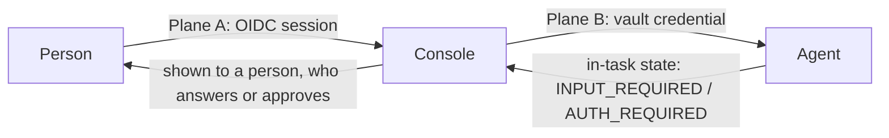

# Identity and access

> For readers who need to understand the three different meanings of "authentication" in Taskbay, and how organizations, roles, teams and grants decide what a person can see and do.

Taskbay mixes three security interactions that are easy to confuse. It keeps them separate on purpose, because treating one as another can leak a credential or turn a task-state change into an authorization.

| | Question | Who and what | Where it lives |
| --- | --- | --- | --- |
| Plane A | Who is this person? | A human signing in to the console | Browser session cookie, server-side session |
| Plane B | Who is the console, to this agent? | The console calling an agent | Credential vault, resolved on the server only |
| In-task | Does this running task need something more? | An agent reporting `AUTH_REQUIRED` or `INPUT_REQUIRED` | A task state in the A2A protocol |

## Plane A: people

There are two modes.

**Development identity.** The default outside production. One local administrator exists and is selected automatically. The client cannot choose another identity or organization. It is for a laptop, not a network. The `npx agent-taskbay` launcher binds to `127.0.0.1` and refuses to use this mode on any other address. A production build only accepts it with both `A2A_AUTH_MODE=development` and `A2A_ALLOW_DEVELOPMENT_AUTH=true`.

**OIDC.** The production mode (the default when `NODE_ENV=production`). The console uses authorization-code login with PKCE, state and nonce, through the `openid-client` library, over HTTPS only. After login it checks that the exact `(issuer, subject)` pair belongs to a user with an enabled membership in the configured organization. Then it discards the provider's tokens. The provider's email, role, organization and tenant claims are never used to create or promote a user.

This means signing in to your identity provider is not enough. An operator must provision the membership first, with a CLI (see [Sign in and roles](../guides/sign-in-and-roles.md)). There is no just-in-time account creation.

The session is an opaque random cookie named `__Host-a2a-session` (Secure, HttpOnly, SameSite=Lax, no Domain). Only its SHA-256 hash is stored, with an absolute expiry. The default lifetime is 8 hours (`A2A_AUTH_SESSION_SECONDS`, allowed range 60 to 86400). Every request re-resolves the session and the current membership, so disabling a user takes effect on their next request. Requests already running may finish. Browser mutations must carry an `Origin` that exactly matches the configured external origin (`A2A_AUTH_ORIGIN`).

There are no API tokens or service accounts. A program outside the browser cannot call the API as a person.

## Organizations, roles, teams and grants

Everything a customer owns belongs to an organization, and every request resolves the organization from the signed-in membership. A browser cannot select one. A deployment is configured for one organization (`A2A_AUTH_ORGANIZATION_SLUG` in OIDC mode, a default `local` organization in development).

Each membership has one role:

| Role | Can do |
| --- | --- |
| `admin` | Everything in the organization: registers and removes agents, manages credentials, teams and grants, escalation policies, reads the organization audit trail. Has access to all agents without grants. |
| `operator` | Starts and replies to tasks, claims and assigns work, decides approvals, but only on agents and skills granted to them. |
| `viewer` | Read only, on granted agents and skills. Never writes. |

Roles are only the baseline. Access to a particular agent comes from grants:

- A grant names a subject (the whole organization, one membership, or a team), an agent, optionally one skill, and a permission: `read` or `operate`.
- `operate` includes `read`. A viewer is never allowed to operate, even with an `operate` grant.
- Enabled grants combine. If no grant covers an agent, a non-admin sees nothing: no tasks, no inbox rows, no agent card.
- A user without a read grant gets a 404, not a 403, so the existence of a task or approval is not disclosed.
- Task filters apply in the database before pagination, so a page never contains rows the user cannot see.

A new non-admin membership starts with no agent access at all. An administrator grants it explicitly.

### Skills

An advertised A2A skill is a description. It does not limit what an agent will do if you send it a message. So a skill-only grant works only for agents that advertise the skill-routing extension. The console then sets the skill in request metadata, and the agent must enforce it and keep new contexts inside it. Without that extension, a person needs a grant on the whole agent. The console does not guess skill routing from prompts or tags. See [skill routing](../reference/extensions/skill-routing.md).

### What access checks do not cover

- Work already accepted into the queue continues after the person logs out or loses access. It is system work.
- Grants control the console's own users. They do not change what the agent itself allows. The console decides independently of what an Agent Card claims.

## Plane B: the console to an agent

Credentials are stored per organization and agent in an encrypted vault table (JWE, `dir` / `A256GCM`), bound to the exact organization, agent and credential. A key ring (`A2A_VAULT_KEYS`, with `A2A_VAULT_ACTIVE_KEY`) lets you rotate: old keys decrypt, the active key encrypts. Secrets go in through a CLI that reads standard input. Browser APIs never accept or return credential values.

Supported kinds: API key header, bearer token, OAuth 2.0 client credentials, and mutual TLS. Each binding lists the exact HTTPS origins it may be sent to. Revoking or deleting a credential fails closed. There is no anonymous fallback. Setup is in [Agent credentials](../guides/agent-credentials.md), and the protection model in [Service identity](../security/service-identity.md).

Not supported: user-delegated OAuth (acting as the signed-in person at the agent). It is tracked in [#1](https://github.com/allsrc/agent-taskbay/issues/1). Plane A tokens are never reused as Plane B credentials.

Outbound requests to agents go through a network policy: HTTPS and an exact origin allowlist in production, DNS answers checked again at connect time, private, loopback and link-local targets blocked unless explicitly allowed, all redirects refused, and responses capped at 25 MiB. Agent Cards can be signed, and a signature is verified against an operator-pinned public key. The console never fetches a key URL named by the card.

## In-task `AUTH_REQUIRED` and `INPUT_REQUIRED`

These are task states set by the agent. They put the task in a person's queue. They are not a login and not an approval.

- `AUTH_REQUIRED` means the agent needs some authorization. The console does not exchange credentials in the message stream.
- `INPUT_REQUIRED` means the agent is asking a question. Anyone with operate access can answer it with a normal reply.
- An approval is a different object with its own record. See [Human in the loop](human-in-the-loop.md).

## Webhooks

Push callbacks from agents do not use sessions. They carry a per-registration bearer credential derived from a server-only key, and are checked against the task they claim to be about.

## When it fails

| Symptom | Cause | Fix |
| --- | --- | --- |
| 401 "Sign in to continue." | No valid session | Sign in |
| 403 "This action is not permitted." | Role too low for the action | Ask an administrator |
| 404 on a task or approval you expect to exist | No read grant for that agent or skill | Ask an administrator for a grant |
| 403 "Cross-origin request rejected." | `Origin` does not match `A2A_AUTH_ORIGIN` | Fix the external origin setting or the proxy |
| 429 "Too many requests." | Per-membership rate limit (per minute: 900 reads, 120 operations, 60 admin) | Wait for the minute to pass |
| 503 "Authentication is not configured correctly." | Missing or invalid OIDC or auth env vars | See [Configuration](../reference/configuration.md) |

## Limits

- One organization per deployment in practice. The data model carries an organization ID everywhere, but there is no organization switcher.
- Teams cannot be escalation targets. Team and grant management is through the admin settings page and CLI, and there is no external identity-provider group sync.
- No API tokens ([#31](https://github.com/allsrc/agent-taskbay/issues/31) discusses them).

## Further reading

- [Decision record: the three authentication planes](../archive/adr/0005-authentication-planes.md)

## Related

- [Sign in and roles](../guides/sign-in-and-roles.md)
- [Agent credentials](../guides/agent-credentials.md)
- [Threat model](../security/threat-model.md)
- [Human in the loop](human-in-the-loop.md)
