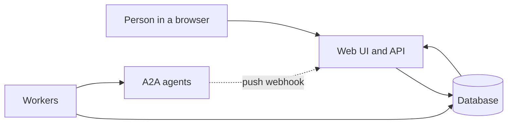

# Overview: what Agent Taskbay is

> For readers who want the mental model before they install anything: what the project does, what it leaves to other systems, and how the pieces fit together.

Agent Taskbay is a console for people who work with [A2A](https://a2a-protocol.org) agents. An agent does the work. Taskbay is the place where a human starts that work, finds it again later, answers the agent when it asks for something, approves risky steps, and can later show who did what.

The project is pre-1.0 (package version 0.1.0). Interfaces and data shapes can change between minor versions.

## The problem it addresses

A2A agent tasks can run for minutes or days. A chat window that holds a stream open for the lifetime of one task cannot cope with that. The browser closes, the connection drops, a second person needs to see the same task, or the agent stops and asks a question nobody is looking at.

Taskbay's answer is to treat the console's own database as the record, not the browser connection:

- A task you start is written to the database first, then sent to the agent by a background worker.
- Everything that comes back (stream events, webhook pushes, polling results) goes through one path into the database.
- The screens read the database. They never read from a live pipe to the agent.

## What it is

| Part | What it does |
| --- | --- |
| Web UI and API (Next.js) | Agent catalog, chat, task detail, inbox, approvals, audit, settings. Checks who you are and what you may do on every request. |
| Workers | Send commands to agents, keep subscriptions and push registrations alive, poll for missed changes, expire approvals, escalate overdue tasks, fan out notifications. |
| Database | PGlite (embedded, file-backed) for local use, PostgreSQL for production. Holds the raw protocol events, the current-state projections, and the audit record. |
| Artifact store | Files and binary parts, stored by content digest on the local filesystem. Database rows hold metadata only. |
| Credential vault | Per-agent credentials, encrypted in the database with a key you control. |

The web process and the workers never talk to each other directly. They coordinate through the database. In the local profile both run inside one Node process. With PostgreSQL you can run the workers as a separate process. See [Running and workers](../operations/running-and-workers.md).

## What it is not

- It is not an agent framework or model runtime. It does not decide what an agent does.
- It is not an orchestrator. It does not route work between agents on its own.
- It does not see inside an agent. A2A keeps an agent's internal steps opaque, and Taskbay shows only what the agent reports in task states, messages and artifacts.
- It is not a generic chat front end. Chat is one view over durable A2A tasks and messages.
- It is not a protocol test bench or a trace explorer.
- It does not run code or markup that an agent sends (see [Rich content](rich-content.md)).

## How it sits next to agents

Taskbay is an A2A client. It reads an agent's Agent Card, picks one of the interfaces the card advertises, authenticates with credentials the console holds, and sends A2A requests with the official `@a2a-js/sdk`. It speaks A2A over JSON-RPC and HTTP+JSON/REST. It rejects gRPC interfaces. It accepts A2A 1.0 and, through the SDK's compatibility mode, v0.3 agents. The supported matrix is in [Compatibility](../reference/compatibility.md).

An agent needs nothing special to be usable: any A2A agent can be registered, given a task and watched. Three optional extensions let an agent do more:

- a structured form for input,
- an approval request the console shows to a reviewer,
- skill routing, so a person can be granted one skill of an agent rather than the whole agent.

Extensions are opt-in by URI in the Agent Card. See [Build an agent for Taskbay](../guides/build-an-agent-for-taskbay.md).

## Who does what

| Person | Typical use |
| --- | --- |
| Operator | Starts tasks, answers input requests, claims and works assigned tasks. |
| Reviewer | Approves, rejects, edits or sends back proposed actions. |
| Administrator | Registers agents, manages credentials, teams and grants, reads the organization audit trail. |
| Viewer | Reads what grants allow. Cannot change anything. |
| Platform operator | Deploys, upgrades and backs up the console. |

Roles are explained in [Identity and access](identity-and-access.md).

## Limits to know up front

- The local profile (PGlite) has a single database owner, so it runs as one long-lived Node process. It is not a serverless target.
- There is no stable, versioned public API yet. Programs that integrate with Taskbay would be using routes meant for the UI. A client SDK is proposed and parked ([#31](https://github.com/allsrc/agent-taskbay/issues/31)).
- Sign-in is by browser session cookie only. There are no API tokens for other applications.
- Taskbay proves what a person approved and what it sent. It cannot prove what the agent then did.

## Further reading

- [Decision records for the architecture](../archive/ARCHITECTURE.md) (archived design document)

## Related

- [Durable tasks](durable-tasks.md): what happens between "send" and "done"
- [Identity and access](identity-and-access.md): who can see and do what
- [Human in the loop](human-in-the-loop.md): inbox, approvals, ownership
- [Quickstart](../quickstart.md)
